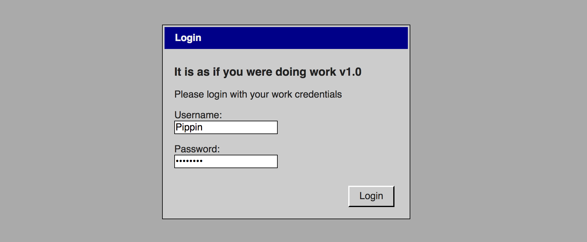

# *It is as if you were doing work*

# [Play Online](http://www.pippinbarr.com/itisasifyouweredoingwork/) (desktop only)

## Description
*The robots are here! No more work! It’s great! Is it great?! Wait! You feel apathetic and unproductive! You miss clicking buttons! You miss waiting for progress bars! You miss checkboxes! You miss work! But it’s going to be okay! Use this handy application and it is as if you were doing work!*

*It is as if you were doing work* is a work of [speculative play](https://www.speculativeplay.com), presenting a vision of a possible/near-future in the form of an application that helps people pretend they're doing standard-issue computer work. Jump in an answer emails, write documents, click check boxes, and so much more!

## Documentation
* Read the [Process Documentation](../process) for todos, process journal, blog posts, and correspondence
* Read the [Commit History](https://github.com/pippinbarr/itisasifyouweredoingwork/commits/master) for detailed, moment-to-moment insights into the development process
* Look at the [Code Repository](https://github.com/pippinbarr/itisasifyouweredoingwork) for source code etc.

## Press
Read the [Press Kit](../press) for press information

* O'Connor, Alice. [_It is as if you were doing work really is_](https://www.rockpapershotgun.com/2017/07/04/free-desktop-work-simulator/). 4 July 2017. Rock, Paper, Shotgun.
* Beschizza, Rob. [_It Is As If You Were Doing Work is a browser game celebrating Windows 3-era cubicle drudgery_](http://boingboing.net/2017/07/04/it-is-as-if-you-were-doing-wor.html). 4 July 2017. Boing Boing.
* [_Канадец создал симулятор офисного работника. Сыграйте в него на работе_](https://meduza.io/shapito/2017/07/04/kanadets-sozdal-simulyator-ofisnogo-rabotnika-sygrayte-v-nego-na-rabote). 4 July 2017. Meduza.
* Porreca, Ray. [_This browser game simulates workplace tedium and soul-crushing, endless memos_](https://www.destructoid.com/this-browser-game-simulates-workplace-tedium-and-soul-crushing-endless-memos-446844.phtml). 4 July 2017. Destructoid.
* Hulfish, Garrett. [PREFER WORK TO LIFE? TRY THE ‘IT IS AS IF YOU WERE DOING WORK’ GAME](https://www.digitaltrends.com/gaming/doing-work-browser-game/). Digital Trends. 5 July 2017.
* Vincent, Brittany. [‘It Is As If You Were Doing Work’ browser game perfectly encapsulates the life of an office worker](https://mic.com/articles/181513/it-is-as-if-you-were-doing-work-browser-game-perfectly-encapsulates-the-life-of-an-office-worker#.IhuGvyNsT). Mic. 5 July 2017.
* Cole, Samantha. [This Game Simulates the Thrill of Working On a Computer](https://motherboard.vice.com/en_us/article/3knd8b/this-game-simulates-the-thrill-of-working-on-a-computer). Motherboard. 5 July 2017.
* Bergert, Denise. [Langweiliger Bürojob als Browserspiel - "It is as if you were doing work"](https://www.pcwelt.de/a/langweiliger-buerojob-als-browserspiel-it-is-as-if-you-were-doing-work,3447298). 5 July 2017. PC Welt.
* Linken, Andre. [It is as if you were doing work - Browserspiel simuliert langweiligen Bürojob](http://www.gamestar.de/artikel/it-is-as-if-you-were-doing-work-browserspiel-simuliert-langweiligen-buerojob,3316648.html). 5 July 2017. GameStar.
* Bonke, Michael. [It is as if you were doing work: Die langweiligste Simulation aller Zeiten?](http://www.pcgames.de/Panorama-Thema-233992/News/It-is-as-if-you-were-doing-work-Die-langweiligste-Simulation-aller-Zeiten-1232379/). 5 July 2017. PC Games (DE).
* Priestman, Chris. [It is as if you were doing work](http://warpdoor.com/2017/07/05/it-is-as-if-you-were-doing-work-pippin-barr/). Warp Door. 5 July 2017.
* Ziegener, Daniel. [It is as if you were doing work v1.0](https://superlevel.de/spiele/it-is-as-if-you-were-doing-work-v1-0/). 5 July 2017. Superlevel.
* Vincent, James. [Relive the Windows 95 glory days with this work simulation game](https://www.theverge.com/tldr/2017/7/6/15927338/work-simulation-game-windows-95-pippin-barr). 6 July 2017. The Verge.
* Förtsch, Michael. [Dieses Bürojob-Webgame treibt einen in den Wahnsinn](https://www.wired.de/collection/life/webgame-pippin-barr-arbeit-simulation). 6 July 2017. Wired (Germany).
* Biggs, John. [New game simulates the old grind](https://techcrunch.com/2017/07/06/new-game-simulates-the-old-grind/). 6 July 2017. Tech Crunch.
* Regan, Tom. [Recreate the thrills of '90s PC admin in this browser game](https://www.engadget.com/2017/07/06/recreate-the-thrills-of-90s-pc-admin-in-this-browser-game/). 6 July 2017. Engadget.
* Homola, Adam. [It is as if you were doing work simuluje práci ve světě, kde všechno dělají roboti](https://games.tiscali.cz/preview/it-is-as-if-you-were-doing-work-simuluje-praci-ve-svete-kde-vsechno-delaji-roboti-299838). 6 July 2017. Games.cz.
* [Ce jeu vous demande de faire tout ce que vous faites déjà au boulot](http://www.ufunk.net/jeux-videos/it-is-as-if-you-were-doing-work/). 6 July 2017. UFunk.
* Arraché, Eric. [Jogo viciante de hoje simula a tortura que era usar o Windows 95 para trabalhar](http://criticalhits.com.br/jogo-viciante-de-hoje-simula-tortura-que-era-usar-o-windows-95-para-trabalhar/). 6 July 2017. Critical Hits.
* Pierre. [Ce jeu en ligne vous fait revivre l’enfer d’un employé de bureau des années 90](http://www.journaldugeek.com/2017/07/06/ce-jeu-en-ligne-vous-fait-revivre-lenfer-dun-employe-de-bureau-des-annees-90/)./ 6 July 2017. Journal du Geek.
* Cantisano, Timi. [Transport yourself back to the era of Windows 95 with this cleverly-built office simulator](https://www.neowin.net/news/transport-yourself-back-to-the-era-of-windows-95-with-this-cleverly-built-office-simulator). 7 July 2017. Neowin.
* Lellouche, Nicolas. [Redécouvrez Windows 95 dans un navigateur Internet](http://www.lefigaro.fr/secteur/high-tech/2017/07/07/32001-20170707ARTFIG00005-redecouvrez-windows-95-dans-un-navigateur-internet.php). 7 July 2017. Le Figaro.
* Mathieu, Bruno. [Cet émulateur de Windows 95 vous fait travailler en jouant (ou l'inverse)](https://www.tomsguide.fr/actualite/windows-95-emulateur-travail,58038.html). 7 July 2017. Tom's Guide.
* [Nostalgie: Revivez l'expérience Windows 95 grâce à un hilarant simulateur gratuit](http://www.20minutes.fr/insolite/2101219-20170707-nostalgie-revivez-experience-windows-95-grace-hilarant-simulateur-gratuit). 7 July 2017. 20 Minutes.
* Tomaszkiewicz, Michał [Symulator pracy wciąga na całe dni robocze](http://www.antyradio.pl/Technologia/Duperele/Symulator-pracy-wciaga-na-cale-dni-robocze-16100). 7 July 2017. Antyradio.pl.
* Pavlenko, Dimitri. [Nostalgie : un mini-jeu émule Windows 95 dans votre navigateur web](http://www.clubic.com/humour-informatique-geek/actualite-833246-nostalgie-mini-jeu-emule-windows-95-navigateur-web.html). 9 July 2017. Clubic.
* Taglinger, Harald. [Wilde Zeiten in der Windows-95-Welt](https://www.heise.de/tp/news/Wilde-Zeiten-in-der-Windows-95-Welt-3766792.html). 10 July 2017. Telepolis.
* Gévaudan, Camille. [«It is as if you were doing work», emploi fictif](http://www.liberation.fr/futurs/2017/07/11/it-is-as-if-you-were-doing-work-emploi-fictif_1583145). 11 July 2017. Libération.
* Douglas, Nick. [Officecore: 10 Games That Simulate Boring Jobs](http://lifehacker.com/officecore-10-games-that-simulate-boring-jobs-1796685998). 14 July 2017. Lifehacker.
* Ganapathi, Anusha. [What is the point, really?](http://www.newindianexpress.com/cities/chennai/2017/jul/15/what-is-the-point-really-1628811.html). 15 July 2017. The New Indian Express.
* Meier, Allison. [A Browser Game Recreates the Tedium of a 1990s Office Job](https://hyperallergic.com/390914/pippin-barr-it-is-as-if-you-were-doing-work-game/). Hyperallergic. 18 July 2017.
* Kaczmarczyk, Karolina. [pippin barr:
it is as if you were doing work](http://www.next-level.org/details/pippin_barr_it_is_as_if_you_were_doing_work/#/). Next Level. 18 July 2017.
* Machiavelli, Gui. [IT IS AS IF YOU WERE DOING WORK (REVIEW)](http://ilu.servus.at/issue11.html). Persuasive Labor Union Special Issue #2 "The Entreprecariat". 10 September 2017.
* Cleon. [It Is As If You Were Doing Work But Actually You're Playing A Video Game](http://tay.kinja.com/it-is-as-if-you-were-doing-work-but-actually-youre-play-1818728688?rev=1506357501356). 25 September 2017.
* Polansky, Lana. [Gaming on the Fringe: 2017 Roundup](http://sufficientlyhuman.com/archives/1557). Sufficiently Human. 2 January 2018.
* Macharia, Tyra. [Artcade Brought a Whole New Meaning to Game Developing](https://thelinknewspaper.ca/article/artcade-2018-concordia). The Link. 10 March 2018.
* Polansky, Lana. [Notes on It’s As If You Were Doing Work: Do Nothing, Feel Fine](http://sufficientlyhuman.com/archives/1590). Sufficiently Human. 3 April 2018.

## License
_It is as if you were doing work_ is licensed under a [Creative Commons Attribution-NonCommercial 3.0 Unported License](http://creativecommons.org/licenses/by-nc/3.0/).
