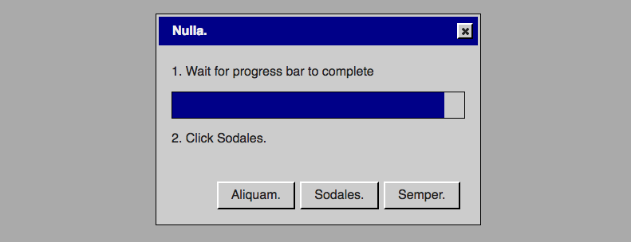

# Blog Posts

Here are public-facing blog posts I wrote about the game.

## Two New Projects, Two Different Processes (2016-12-29)

I&#8217;m trying to write more things, so this is a thing.

Currently I&#8217;m working on two new games at the same time &#8211; one is more of a standard kind of &#8220;thing I just want to make&#8221; while one is more connected to a research project I&#8217;m involved in at work. I&#8217;m working on them at the same time because I feel I ought to be doing the work one, but I really want to be making the other one too. We&#8217;ll see if that backfires.

One thing I&#8217;ve noticed is that the two projects capture two different approaches to game making from my perspective &#8211; they&#8217;re both processes I&#8217;ve followed before, but it&#8217;s funny experiencing them simultaneously. Check it out&#8230;

_SNAKISMS_ is a kind of spiritual successor to _PONGS_ and _BREAKSOUT_ in that it&#8217;s multiple versions of a classic game (_Snake_), with the change this time being that I&#8217;m trying to convey different &#8220;isms&#8221; or philosophies through the mechanics of the game by making small changes. The process here has very much been cerebral &#8211; sitting down with a notebook or my laptop and literally just writing down the names of philosophies and trying to work out how you could make a game of _Snake_ out of them. There was no need for any coding or anything because it&#8217;s such a simple game &#8211; so the whole thing can be pretty much designed without touching development at all.

_It is as if you were doing work_ is kind of a follow up to _It is as if you were playing chess_ but is also tied more broadly to an interest I&#8217;ve had lately in thinking about standard user interface elements in the context of play, and the idea of play as a form of labour. In this case I only have a vague kind of idea with what the game is meant to be like, effectively &#8220;WarioWare with standard UI elements&#8221;, and as such my process has been much more to grapple with the actual tools for making the game in order to feel my way toward design decisions. As such, I&#8217;ve been fighting with jQuery UI and its Theme Roller to try to capture an appropriate theming of the UI elements (so that they look a bit like _It is as if you were playing chess_) and working out what the game is from the inside out in some ways.

Both those tactics for game design (in the head versus in the technology) are approaches I&#8217;ve taken in the past, and of course they blur into each other the further you get into development, but it&#8217;s been quite fun experiencing them at the same time like this &#8211; has provided me with an odd opportunity to observe myself working in some sense.

Bye.

## New (quite old) project: It is as if you were doing work (2017-03-27)

Having finished with both _v r 3_ and _Let&#8217;s Play: Ancient Greek Punishment: CPU Edition!_ I&#8217;m naturally onto a new project to occupy myself with. In this case, though, it&#8217;s actually a return to something I&#8217;d started working on late last year, but lost steam on in favour of _SNAKISMS_. This is the kind of sequel to _It is as if you were playing chess_ called _It is as if you were doing work_. The idea is, as you might imagine, to follow a similar pattern of heavily interface-driven play, but this time for the interfaces in question to revolve around the idea of work/productivity, rather than the game of chess.

I was largely stymied by the project last year because I kept tripping over myself in terms of what sort of scale to make it at, and what its identity would be. I was thinking about everything from extreme puzzle games to procedural narrative as possible lynchpins for it. But in fact all those of those extra layers feel now like they more represent a kind of anxiety/inadequacy surrounding the base concept of the game &#8211; or perhaps more accurately, simply not knowing what it was. So I spent today just making the absolute simplest example of the game I could image, as pictured above.

The game fades in two radio buttons to choose between, and another button to click, and an instruction tells you which radio button to select and tells you to then click the button. Having implemented this, I feel like I&#8217;ve returned to a little bit more clarity in terms of how I envisaged the game in the first place: a hyper-simple &#8216;simulation&#8217; of doing the kinds of work that user-interfaces generically seem to represent &#8211; selecting/inputing/manipulating information on a computer. The fact that you&#8217;re told specifically which actions to carry out is part of the idea of the game being a simulation of work rather than work itself and thus, ostensibly, kind of relaxing to &#8216;play&#8217; &#8211; you don&#8217;t have to actually make decisions, you just appear to be making decisions. Similarly, the interface is highly abstract (notably with a non-language for all the labelling/content) so that you also don&#8217;t have to engage with any particular forms of meaning/interpretation &#8211; you can just let the world go by as you do the right thing over and over. I did toy with the idea of having no instructions at all, so you could just do &#8216;whatever&#8217;, but in fact that would probably be _less_ relaxing, because you&#8217;d have to make decisions (not to mention more boring because it would be literally meaningless).

So having made this minimal version of the game, I&#8217;m feeling a little more confident in terms of proceeding with the next steps. Next is clearly to add different possible interfaces that you could encounter (e.g. checkbox, text box, menu, slider, progress bar). After that I need to decide whether there&#8217;s any real sense to having more complex &#8216;compound&#8217; interfaces with multiple elements, or whether that would actually dilute the purity of the interfaces as they stand. And then I also need to figure out whether the game ought to have some sense of progress/completion involved (e.g. points, an ending), or whether the idea is more just that it goes on indefinitely &#8211; for as long as you want to appear to be working (not unlike the &#8216;boss mode&#8217; in some earlier videogames).

Anyway, it&#8217;s a testament to making a (relatively polished) mini-version of the game being a useful way of understanding what you&#8217;re doing. Rather than spinning my wheels in design and losing touch with the concrete nature of the game, making a working &#8216;vertical slice&#8217; has helped recover the meaningfulness of the base interactions and thus to get some traction on the overall project.

Now don&#8217;t forget to select ▝▍▀▟▖▀▎ and then press ▚▎▗▀ before you go.

## Aesthetics considered harmful (2017-05-31)

Why hello there! I just got back from travels to Japan and New Zealand and so I&#8217;m trying to get back in the saddle of writing a few times a week. It&#8217;s an uncomfortable and unforgiving saddle on an unpleasant, mean-spirited, and violent horse, so we&#8217;ll see how it goes.

Anyway, the other day I was thinking about how the aesthetics of a game (or probably any other creative work or, perhaps, anything at all) can really paint (ha ha) you into a corner in terms of other elements of a project. Specifically, before leaving I&#8217;d been working on a project called _It is as if you were doing work_ as a kind of follow up/semi-sequel to _It is as if you were playing chess_, where the idea is to look like you&#8217;re working rather than playing chess.

I used the spirit of the aesthetic of the previous game as a starting point, so had these very minimalist buttons and checkboxes and so on set against a dark grey background. In the interest of simplicity and minimalism I even went to far as to remove language altogether so that you had these kinds of alien shapes instead of something intelligible &#8211; pure interface. It looked quite good.

The problem is, it looked quite good in a way that utterly diverted me from the actual point of the game I was initially trying to make. And there&#8217;s the rub (apparently that expression derives from bowls, who knew?) – when you set an aesthetic you&#8217;re setting a kind of emotional tone for the overall project which, in turn, seeps out into all the other parts, notably the design of the actual interactive bits, the dynamics, etc. So by having established (and fallen a bit in love with) a minimalist/anti-meaning aesthetic, I was driven to think about the game itself as minimalist and anti-meaning. The problem with that being that that wasn&#8217;t what I wanted to make.

The idea behind _It is as if you were doing work_ was all about creating (somehow) the sensation of &#8220;working&#8221; as a kind of game. So it was to focus on that sense of mini-achievement you have when you do some little work unit like closing a dialog box or clicking a button, and by building up lots of these it was going to allow you to sort of look like you were working (ala the &#8220;Boss Key&#8221; in a game like _Leisure Suit Larry_) but also _feel_ like you were being &#8220;productive&#8221; in this essentially empty way.

In order to create those sorts of feelings, though, you really need to evoke familiar tropes of work and the kinds of &#8220;content&#8221; that work has. It&#8217;s hard to represent those tropes in a futuristic-looking minimalist environment, particularly if you&#8217;re foregoing the use of intelligible language. And so what happened is I spent quite a while unable to make progress &#8211; the aesthetics of the interface I&#8217;d create didn&#8217;t _want_ to be the game I wanted to make, and I couldn&#8217;t see that for quite a while.

Finally, after setting the game aside for quite a while, I had the sudden zennish realisation that I needed to rework how the game _looked_ in order to be able to actually work out how it would _behave_. By reskinning it to look more like Windows 95 and with text in English, it was suddenly possible to _see_ how the game could move forward, and in fact a bunch of ideas occurred to me and progress was made.

So, be careful with aesthetics, my friends &#8211; they sure as hell aren&#8217;t some sort of skin on top of the &#8216;real game&#8217;, and in fact they can completely dominate your process without you quite knowing it.

You&#8217;ve been warned.

## It is as if you were back to work (2017-06-10)

Over the past few days I've been successfully getting back to work on _It is as if you were doing work_. The joke probably writes itself there, but frankly it's too hot in the apartment to really dwell on it.

I wrote a little while back about how freeing myself from the initial aesthetic of the game had really opened up my ability to think about the game again ([Aesthetics Considered Harmful](/2017/05/31/aesthetics-considered-harmful)). You can see in the above image that I've restyled the game to use a kind of throw-back/retro aesthetic referencing Windows 95. Importantly it's a formal aesthetic that, to me at least, cries out "this is work!" and that's a key component of the experience the game it trying to deliver. Work needs to _look like work_.

At this point I have a prototype able to generate dialog boxes (in that style) which contain a random set of interface elements (sliders, progress bars, radio buttons, etc.) and instructions on what to do with them. As I've been working on this more procedural aspect of the game (or its 'interactive aesthetic' or whatever) I've of course run into other, different issues and roadblocks. Notably, there has been a desire to make the game be... like a game.

But 'some games are better without gameplay'... or at least they're better without 'game-y play'? In constructing this game which is about feeling like you're working, it seems to me that making it more game-like (in the conventional sense) naturally draws the player away from the sensation of 'work' (albeit that playing games frequently feels like labour, etc.). I was coming up with ideas like little popups telling you you made money each time you click an interface element (correctly), or dialog boxes that move around on the screen as you try to use them, or highly complicated/obfuscatory instructions for what to do in a dialog box. Those are all pretty fun things that would make for a more entertaining game and there's nothing wrong with them, but they're still wrong for this particular game with this particular experience in mind.

It's back to that idea of a 'ground truth' of design that I think about sometimes. You need to _really know_ what the underlying premise/experience of the thing you're making is, because literally every single decision you make at every level of design and implementation tends to either serve or betray it. Moving dialog boxes are almost objectively hilarious, but they don't serve a ground truth of feeling like you're doing work, because that's not what it _looks like_ when you're doing work. And of course I could spin some narrative reason why work-of-the-future involves moving dialog boxes, but it's not especially plausible. (Though now I think about it, in a simulation of work, why not have added challenge element? I think because the idea here is also to feel comfortable and competent, rather than challenged.)

So in reconnecting with the ground truth(s) of _It is as if you were doing work_ it's been easier and easier to make the decisions I need to make moving forward. Whether or not it will end up as a 'good game' is entirely debatable, but it will at the very least serve the idea I started making it for in the first place.

## Narrative framing in It is as if you were doing work (2017-06-14)

In the past couple of days I've really managed to get the basic structure of _It is as if you were doing work_ up and running in terms of the idea of dialogs popping up, telling you what to do, and knowing whether or not you did that correctly. Part of me wanted to just scream "done!" and immediately upload the game to my website, but as we all know, just getting the basic mechanical nature of a game/thing running really isn't the full picture. As I sat there starting at the dull grey background of the game, it was sadly apparent I need some kind of larger framing for the core activity of clicking around in dialogs - quelle surprise.

It's especially important to create this frame for this game because, although the 'point' is the act of filling out dialog boxes, the point can only register if the game establishes the hypothetical context in which that act is taking place. Namely, the near-future in which most or all computer work is automated and humans have nothing to do with themselves and some of us pine for that feeling of 'getting work done on the computer' and require a game/computer program to allow us to simulate that and chase that feeling. As such, the game now needs enough extra stuff to bring across the idea that _It is as if you were doing work_ is that program/game.

I've discussed possible extra UI elements with Rilla and with my colleague Jonathan Lessard and collected some nice ideas concerning having some more active background (including the idea of a desktop picture) and the idea of interactions that take place outside the basic 'workflow' (ha ha) of the game. Importantly and appropriately, the game needs to set up this near-future idea via interface elements specifically - like my earlier game [MANIFEST]({{ site.url }}/2014/09/30/manifest/) it needs to _be_ the program that would exist in this near future, rather than trying to portray that near future in a more traditional narrative way.

Current thoughts for how to establish the narrative frame via interface-stuff are:

* _Login screen to enter username and password_. Implicates the player as a 'real user' right away, allows some text that could communicate the basics of what the program is, perhaps through title and slogan, say.
* _Random popup images of people happily working_. I like the idea the system can bring up inspiring images of work so that you can feel more part of a community of happy and effective human workers. Thinking of using explicitly watermarked stock images for this.
* _A cheesy desktop background_. Rather than the solid grey I have right now, which is too blatantly dystopian, it makes sense to have a kind of illusion of the customised workspace with a 'personal' image of something like a cat. (Could make this customisable, but suspect it may be better not to allow that control.)
* _Computer-generated music_. Ideally I'd like some kind of chipper/energetic music playing the whole time, ala musak. It should emphasise the kind of dissonance of the task.
* _Informational dialogs_. Along with the task-oriented dialogs, I'm planning to have excessive other popups that keep you up to date with your performance, areas of improvement, promotions, warnings, etc. This will add to visual confusion, which I think will feel good/weird, but is also an opportunity to continue convey the overall idea.
* _Break time_. Jonathan had the genius idea of including mandatory "breaks" in the work where you have to have some leisure time. You could just listen to the music, look at the desktop and, as Jonathan pointed out, perhaps even play a game. Amazing.

So that's where things stand with the game for the moment. A fair bit of work left to do, but generally it's _known_ work rather than the horrors of _unknown_ work where you know something's wrong but not what to do about it.

## Something to do while you're doing something (2017-06-19)

Work continues on _It is as if you were doing work_. Over the last passage I made a slightly dispiriting discovery, again concerning something of a conflict with the 'ground truth' of the project, but then also think I have a solution for the problem.

The issue I discovered is that on implementing an actual stream of dialog box-based tasks for the user to complete, it's actually pretty stressful. It quickly harks back to the dynamics of _[Let There Be Smite!](http://www.pippinbarr.com/2011/07/01/let-there-be-smite/)_, where you're getting completely overwhelmed by dialog boxes and are much more focused on getting rid of them that on any sensation of effectiveness and competence.

The obvious solution to that problem is simply to slow the flow of dialog boxes down until it's fairly trivial to deal with them one by one and thus feel that sense of "_there!_" each time you get one done. The problem with _that_, though, is that then the dialog boxes are coming slowly enough that there's only one or two on the screen at a time, which looks quite bare aesthetically.

In fact this gets back to the nature of dialog boxes themselves as interface elements: they're almost always used as momentary interactions rather than sustained interactions. This is contradictory to the fundamental objective of the game being to simulate continuous, effective, work. That's simply not what dialog boxes are for, so they're a somewhat ill-suited tool, even though they look great.

So my planned solution is, sensibly (and probably belatedly), to return to this idea of work and to think about how dialog boxes are contextualised in work - that is, you're usually doing _something else_ when they pop up. They interrupt another interaction, you deal with them, and then you return to the initial interaction. And that initial interaction is often/generally the _actual work_ you're doing.

The plan is, therefore, to include more 'longitudinal' tasks in the interface, like writing a document or doing data entry, that then serve as the basic texture against which the dialog boxes can appear and diversify your experience a bit. As such there will be three levels of interface operating at once:

- the desktop (with a couple of icons on it) serves as a well-known background that aesthetically signifies 'work' and also allows for some user choice in terms of interaction
- the core work tasks(s) are documents that the user is filling out over time and signify larger blogs of work that you're actually doing long term
- the dialogs pop up randomly over time as a way to create a distraction and thus that multi-modal feeling of working on a computer

Those three levels seem like they ought to work together well. That said I also need to actually implement the longer-term work interaction to make sure that it fits in and solves the problem of dialog-anxiety/dialog-scarcity. So it goes.

## You're doing so well forever (2017-06-21)

One of the elements of _It is as if you were doing work_ I've been thinking about lately is the question of feedback to the player on how well they're doing. It's gone through a few phases in conversation with thinking about what the imaginary narrative context of the game is.

Initially, the idea was very much to have a clear idea of getting things _right_ or _wrong_ when you play the game. So if you click the wrong button, say, a 'bad sound' plays, the dialog boxes shakes and closes, and you would lose some salary. If you kept getting things wrong then you'd get warnings, demotions, and would eventually be fired. Vice versa for getting things right: you get happy sounds, salary bonuses, and promotions.

However, in trying to design the interface itself and find a place to list 'salary' I was reminded of Jonathan pointing out that the person is literally not earning anything through this work. With that in mind it started to seem like listing an explicit 'imaginary salary' would be more of a distraction, so I got rid of that idea in favour of the more abstract/interpretation-friendly thing of just having your rank.

And then as I was working on the game more, I started wondering why I would have negative feedback in the first place, since it doesn't really fit in with the empowering fantasy of being good at your job. So I moved to a model where there is a correct way to complete a dialog, but if you get it wrong, it just won't close (and may even indicate where the problem is so you can fix it easily).

With this new model of absolutely no failure being allowed, it no longer made sense to have the idea of demotions in rank, and therefore the idea of there even being a hierarchy of rank stopped making sense. Instead, I now have a "job position superlative generator" that comes up with job titles as you get "promoted" (laterally) over and over again. "Super Dialog Processor", "Premium Interactivity User", "Chief Screen Expert", etc.

All of this lends itself to an atmosphere of extreme effusiveness about your skills and success, while also signaling a kind of total stasis at the same time, which feels about right for the narrative framing. So it's quite a journey from the very evaluative/severe version to this super-positive/going-nowhere version.

[Okay.]

## Radically open game development? (2017-07-07)

Since I made [_SNAKISMS_](https://github.com/pippinbarr/SNAKISMS) earlier this year I've moved toward an open-source version of my games as much as I've been able. [_v r 3_](https://github.com/pippinbarr/v-r-3) was a challenge because it included proprietary assets I'd paid for and because I'm dumb at Unity, but in general I've been trying to release my code when I release a project, including all the commits etc. (It is also making me hyper-aware of how absolutely terrible I am about commenting my code lately - really must fix that.)

To go with the basic availability of my code (under a [Creative Commons Attribution-NonCommercial 3.0 Unported License](https://creativecommons.org/licenses/by-nc/3.0/)), I've also used GitHub to host other elements of the development process (examples here are from _It is as if you were doing work_):

- [Diary and To-Dos](https://github.com/pippinbarr/itisasifyouweredoingwork/blob/master/process/README.md): My usual practice of writing a development diary and the to-do lists I create and work through while writing the code itself are part of the distribution
- [Screenshots](https://github.com/pippinbarr/itisasifyouweredoingwork/tree/master/press/images): I've also included screenshots taken as part of the process of development (usually of stages of the visual progress of the game, sometimes of funny bugs or mistakes I've made).
- [Correspondance](https://github.com/pippinbarr/itisasifyouweredoingwork/blob/master/process/CORRESPONDENCE.md): Emails I've sent back and forth with testers (when permission is given) are available. (Spoiler alert: it's almost always my parents.)
- [Press Kit](https://github.com/pippinbarr/itisasifyouweredoingwork/blob/master/press/README.md): Although I'm a huge fan of [presskit()](http://dopresskit.com/), I've taken to having my press kits be part of the code repository as well, for an "everything in one place" kind of feeling. This is all greatly facilitated by [markdown](https://daringfireball.net/projects/markdown/syntax), which I am deeply, romantically in love with.
- [Press Files](https://github.com/pippinbarr/itisasifyouweredoingwork/tree/master/press/articles): As press rolls in for a game (or, more often, trickles in, or, frankly, just doesn't come in at all) I put links to coverage in the press kit and have now also taken to capturing the articles themselves off the web and including them in the press section. (The death of _Kill Screen Daily_ was a wake-up call there, as they were major and appreciated supporters of my work.)
- [Social Media](https://github.com/pippinbarr/itisasifyouweredoingwork/tree/master/press/socialmedia): As of _It is as if you've been doing work_ I've also been trying to capture social media reactions to the game by saving Twitter search results as well as tweets directly to my account
- _And_ I keep planning (though not following through as yet) on including scans/photos of my notebook pages pertaining to the particular game.

Obviously that's quite a lot of information to package with my games themselves, and it's in no small part so voluminous because as someone working as an academic, I'm working with my colleagues (notably [Rilla Khaled](http://rillakhaled.com/) and [Jonathan Lessard](http://jonathanlessard.net/)) toward a method of game design and development process analysis. (We're calling this [Games as Research](http://gamesasresearch.com/). That website will have actual information at some point.)

_However_, with both _SNAKISMS_ and _It is as if you were doing work_ one thing that came up I wasn't expecting (for reasons I don't pretend to understand) was that people were interested in engaging with the work 'as software' by [writing fixes for bugs in a game](https://github.com/pippinbarr/itisasifyouweredoingwork/pull/2) or improving a game by adding functionality like [making the game installable on Android](https://github.com/pippinbarr/SNAKISMS/pull/2)!

This makes me wonder about a couple of more "extreme" avenues that are entirely plausible with something like GitHub as the central repository of my games (usually)...

_Real-time visible development_. At present I make my game repositories private until I release the game, at which point I make them public for people to look at whatever they want. It occurs to me that I could develop games "in public" the whole time such that people who gave a shit (this could easily, _easily_ be nobody) would actually be able to keep track of the game as it developed, play incremental builds and generally watch me being terrible at game development. _Live_! The obvious reasons I haven't done this as yet are that a) I'm self-conscious about how shitty my development actually is, b) I'm self-conscious that nobody would care, and c) there's some (probably dumb) fear that if the development were open, people would lose interest in the final product when I actually released it. None of those reasons, at this moment, strike me as great reasons not to just do it anyway. The primary reason probably being: "who even cares?"

_Real-time visible radically open development_. It's only a short step from having my code repositories open while developing to accepting the idea that random strange might want to randomly contribute to the game itself. It's easy to imagine, for example, somebody randomly populating an array of job titles, say, with their own ideas, or editing the list of inspirational slogans, or adding a whole other kind of dialog box. (Or not, of course, I'm not saying people would actually want to do this, just that they _could_.) This one troubles me much more significantly because, well, I'm already not the best collaborator in the first place, and the idea of "random collaborators from the internet" gives me chills. On the other hand, if it's just people suggesting additions/subtractions to the code base, there wouldn't be any harm in this and it _could_ be pretty interesting.

In the end I suspect it might be good to have the development in public to see what happens (while being aware it might change how honest and open I feel able to be in, for example, my diary). The question of whether people might want to interact with the code itself during development is just something that could be explored as it happened (or didn't happen). It's certainly a weird and interesting idea. So, let's see. Maybe.

## 
